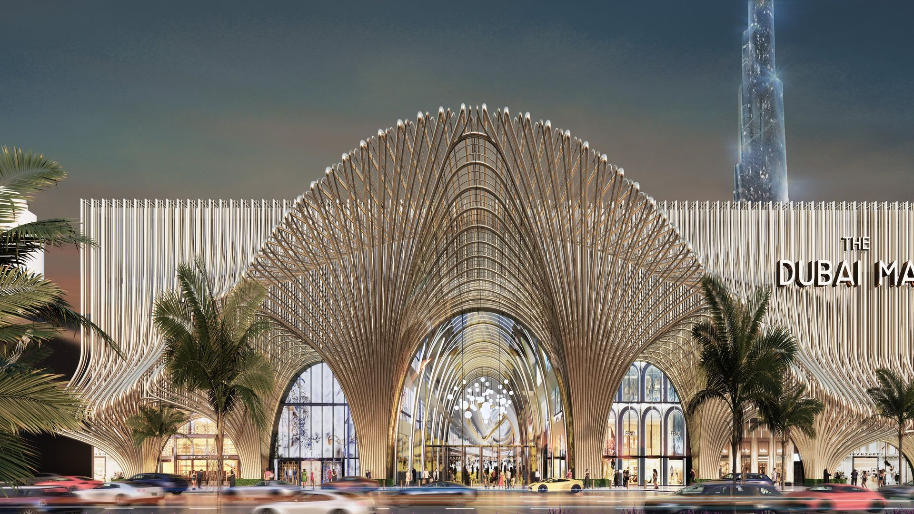
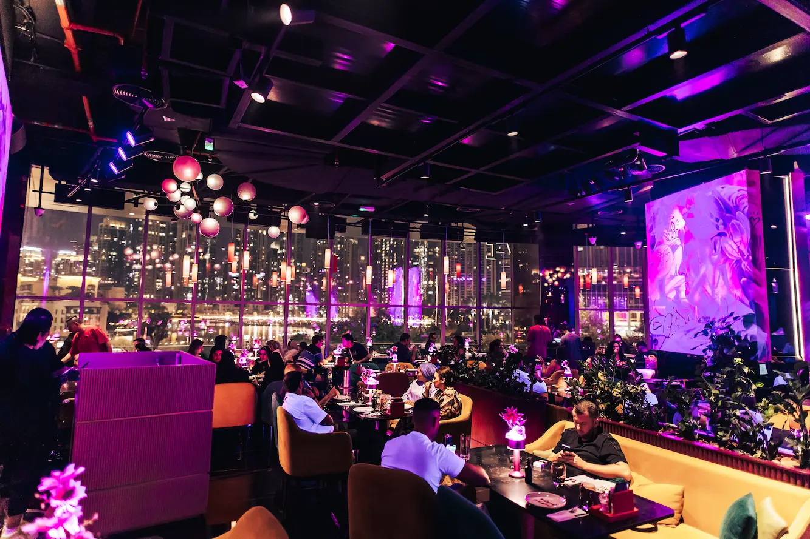
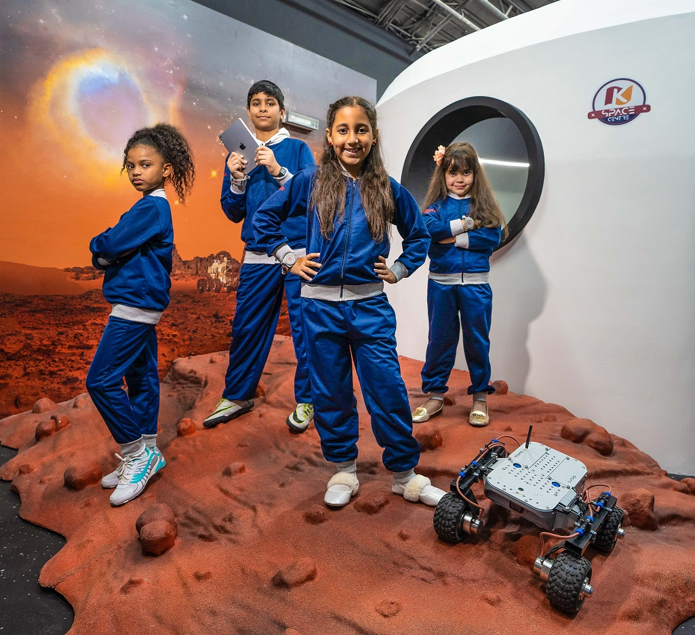

# The Dubai Mall — Interactive Presentation

An immersive, interactive web presentation designed for The Dubai Mall. This project showcases the mall's luxury, dining, entertainment, and venue spaces using cutting-edge web technologies, smooth scroll animations, and a premium cinematic design language.

## 🌟 Features

- **Cinematic Hero:** Immersive autoplaying video background with synchronized audio and interactive mute controls.
- **Scroll-Storytelling:** Apple-style scroll-driven video scrubbing sections.
- **Parallax Navigation:** Interactive image galleries, 3D hover effects, and parallax scrolling.
- **Dynamic Content Sections:** High-end presentations of Luxury Brands, Fine Dining, Entertainment (KidZania, VR Park), and Event Spaces.
- **Virtual Tour & Leasing:** Integrated contact/leasing forms and virtual tour capabilities.

## 📸 Screenshots

| Hero Showcase | Dining & Lifestyle |
| :---: | :---: |
|  |  |

| Entertainment Options |
| :---: |
|  |

## 🚀 Tech Stack

- **Framework:** React 18 with Vite
- **Styling:** Tailwind CSS (customized for premium dark-mode aesthetics)
- **Animations:** Framer Motion (useScroll, useTransform, complex spring animations)
- **Carousels:** Swiper.js
- **Icons:** Lucide React
- **Language:** TypeScript

## 🛠️ Getting Started

### Prerequisites
- Node.js (v18 or higher)
- npm or yarn

### Installation

1. Clone the repository:
```bash
git clone https://github.com/Sameer1551/mall.git
cd mall/project
```

2. Install dependencies:
```bash
npm install
```

3. Run the development server:
```bash
npm run dev
```

4. Build for production:
```bash
npm run build
```

## 🎨 Design System

The application relies on a strictly curated design system to maintain a premium feel:
- **Colors:** Deep blacks (`#050505`), subtle dark grays (`#111111`), and a signature metallic gold (`#D4AF37`) for accents.
- **Typography:** 
  - `Bodoni Moda` (Serif) for elegant, high-impact headings.
  - `Inter` (Sans-serif) for clean, readable body text.
  - `Space Grotesk` for numbers and stats.
- **Animations:** Micro-interactions on all cards, smooth fade-ins, and complex scroll-bound video scrubbing.

## 📄 License

This project is proprietary and confidential. All image assets belong to their respective copyright holders (The Dubai Mall, Emaar Properties, etc.).
